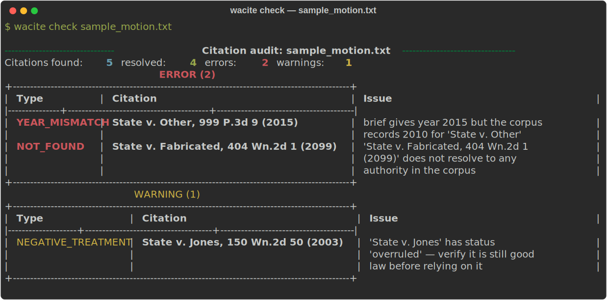

# wa-cite-check

> **Catches the mistake that's getting lawyers sanctioned.** Courts are now penalizing
> attorneys for briefs containing AI-fabricated or mis-cited case law. `wa-cite-check` is an
> **offline citation auditor**: point it at a motion and it flags every citation that doesn't
> exist, has the wrong party name or year, or points to an authority that's been overruled —
> *before* the brief is filed.



A standalone Washington legal **citation checker** built on top of a Washington legal corpus
(the corpus is produced by a private sibling system; see
[wa-legal-ai-showcase](https://github.com/skirby359/wa-legal-ai-showcase) for that architecture).

**Phase 1 — format / accuracy audit.** Point it at a motion (`.docx`, `.pdf`, or `.txt`) and it
extracts every citation, confirms each one exists in the corpus, and cross-checks the attached
**case name**, **year**, **parallel cite**, and **authority status** (overruled / repealed / etc.).
It runs **fully offline**: the corpus database is read once to build a small portable SQLite index;
all checking happens against that file.

**Phase 2 (optional) — substantive alignment.** With `--align`, each citation that resolves is
checked for *substance*: does the cited authority actually support the proposition it's offered
for? An LLM judge (local **Ollama** by default, or **Claude**) reads the proposition alongside the
most on-point passages and returns a verdict. All Phase-2 findings are advisory.

## Try the example

The image above is the real output of auditing [`examples/sample_motion.txt`](examples/sample_motion.txt)
— a short brief excerpt with three planted defects. Reproduce it against a small in-process
fixture index (no PostgreSQL needed):

```bash
pip install -e ".[build]"
python docs/build_demo_svg.py     # builds a fixture index, audits the sample, writes docs/demo.svg
```

It correctly reports: a **NOT_FOUND** fabricated case, a **YEAR_MISMATCH**, and an **overruled**
authority (NEGATIVE_TREATMENT).

## How it works

```
motion.docx ─▶ extract text ─▶ parse citations ─▶ audit ─▶ report
                                     │                │
                                     │           cite_index.sqlite (offline)
                                     │                ▲
                          short-form (Id./supra)      │
                                                 build-index (one-time, reads corpus Postgres)
```

## Install

```bash
pip install -e .            # runtime (check)
pip install -e ".[build]"   # + psycopg, needed only for build-index
pip install -e ".[align]"   # + LLM judge / embeddings, for the Phase-2 --align pass
pip install -e ".[dev]"     # + pytest
```

## Usage

```bash
# One-time: build the portable index from the live corpus.
wacite build-index --out cite_index.sqlite

# Audit a motion (Phase 1, fully offline).
wacite check motion.docx --index cite_index.sqlite
wacite check motion.pdf  --json        # machine-readable report

# Add the Phase-2 substantive-alignment pass with a local Ollama judge.
ollama pull qwen2.5:7b-instruct
wacite check motion.docx --align \
    --llm-provider ollama --llm-url http://localhost:11434 \
    --llm-model qwen2.5:7b-instruct
```

Exit code is `1` when any ERROR-level finding is present (handy in a pre-filing check), `0` otherwise.

## What it checks

| Finding | Severity | Meaning |
|---|---|---|
| `NOT_FOUND` | error | Citation doesn't resolve to any corpus authority (typo or fabricated). |
| `NAME_MISMATCH` | error | Reporter cite resolves, but the party name attached is wrong. |
| `YEAR_MISMATCH` | error | Parenthetical year disagrees with the corpus. |
| `PARALLEL_MISMATCH` | error | The given parallel reporters point to different authorities. |
| `NEGATIVE_TREATMENT` | warning | Authority is overruled / repealed / abrogated / etc. |
| `PIN_NOT_VERIFIED` | info | Pin page can't be confirmed — the corpus has no star pagination. |
| `UNSUPPORTED_PROPOSITION` | warning | *(--align)* The judge found the authority doesn't support the proposition. Advisory. |
| `WEAK_SUPPORT` | info | *(--align)* The judge found only partial/uncertain support. Advisory. |

## Limitations

- **Pin pages** are reported, not verified (no page-level mapping in the corpus).
- **Scanned PDFs** need OCR first; only text-based PDFs are read.
- Reporter folding handles common WA / Pacific / Federal variants (`Wn.2d` ⇄ `Wash. 2d`); exotic reporters may miss.

## Tests

```bash
pytest        # runs against an in-process fixture index — no PostgreSQL needed
```

## Relationship to the corpus

This project reuses, with attribution in the source, the citation extraction patterns, cite/name
normalization, and `authority_status` vocabulary from the private WA Legal AI system (architecture
shown in [wa-legal-ai-showcase](https://github.com/skirby359/wa-legal-ai-showcase)). Phase 1 couples
to it only through the one-time `build-index` read of the corpus. The optional Phase-2 `--align`
pass imports that system's LLM provider and embedding loader and reads the corpus at check time.

## What this project demonstrates

- **Practical, deployable AI safety** — turning the abstract "LLMs hallucinate citations" problem
  into a deterministic, offline check a firm can actually run before filing.
- **Domain + engineering fluency** — built by a practicing attorney who also writes the parser,
  the SQLite index, and the LLM-judge alignment pass.
- **Sound design judgment** — deterministic checks gate the exit code; the probabilistic LLM pass
  is strictly advisory. The system never lets a model's guess fail a brief silently.

---

*Built by [Steve Kirby, J.D.](https://www.linkedin.com/in/kirbysteve) — technology attorney and AI builder.*
